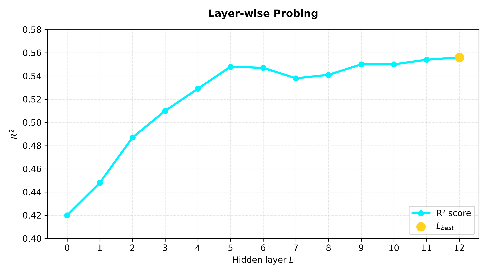

# <center>RegiBERT: Continuous Modeling of French Linguistic Registers on TrémoLo via Label Distribution Learning and Topological Probing</center>

<p align="center">
  
  
  
  
  
  
</p>

<p align="center"><a href="https://your-demo-url.com">Live interactive 3D projection</a></p>

---

## 1. Abstract

The detection of linguistic registers has historically suffered from rigid classification approaches (hard labels). However, natural language is inherently nuanced and ambiguous. This project introduces RegiBERT, a CamemBERT-based model designed to capture this linguistic continuity. Rather than assigning a single exclusive class to a sentence, the model learned to predict a probability distribution (soft labels) using the annotated TrémoLo corpus. 
RegiBERT achieves a validation KL divergence loss of 0.365, a Mean Absolute Error of 0.179, and an overall accuracy of 84.5%. Layer-wise probing further reveals that stylistic nuance crystallizes in deeper transformer representations, peaking at Layer 12 ($R^2 = 0.556$). A 3D UMAP projection calibrated on the validation subdataset confirms this structure geometrically, revealing a continuous manifold where the standard register smoothly connects the formal and colloquial clusters.

---

## 2. Introduction

The computational analysis of stylistic variations almost systematically hits the limits of discrete boundaries. In real-world communication, a post is rarely 100% colloquial or 100% formal. It navigates across a continuous spectrum, a phenomenon well-established in sociolinguistics ([Labov, 1972](#ref-labov1972); [Biber, 1988](#ref-biber1988)). Enforcing rigid, single-label categorization on naturally ambiguous data leads to severe information loss and overconfident predictions. To overcome this deficit, RegiBERT abandons classical one-hot encoding in favor of distribution regression via Label Distribution Learning ([Geng, 2016](#ref-geng2016)). Built on `camembert-base` ([Martin et al., 2020](#ref-martin2020)), a RoBERTa architecture ([Liu et al., 2019](#ref-liu2019)) pretrained on French OSCAR data ([Ortiz Suárez et al., 2019](#ref-ortiz2019)), RegiBERT leverages native French representations, making `camembert-base` exceptionally well-suited for this task. By leveraging the exact ground-truth proportions provided by the TREMoLo-tweets corpus ([Mekki et al., 2021a](#ref-mekki2021taln); [Mekki et al., 2021b](#ref-mekki2021ranlp); [Mekki et al., 2025](#ref-mekki2025)), RegiBERT is  optimized using a KL divergence loss function ([Kullback & Leibler, 1951](#ref-kl1951)).

Beyond the predictive task, this work integrates a Mechanistic Interpretability dimension. Through layer-wise probing across the transformer's attention layers ([Tenney et al., 2019](#ref-tenney2019)), we isolate the optimal depth where the topology of the registers crystallizes most clearly. The vector representations from this layer are then extracted and projected into a 3D space using UMAP ([McInnes et al., 2018](#ref-mcinnes2018)).

To achieve this, the project explores four main steps :
First, register classification is modeled as a continuous Label Distribution Learning task instead of using hard labels. Second, layer-wise probing locates where stylistic features crystallize within the transformer. Third, the sample size for UMAP trustworthiness is estimated using the Central Limit Theorem. Finally, a live pipeline projects live Bluesky streams into the calibrated 3D space.

This document details the entire methodology, ensuring full reproducibility.

***A quick note on linguistic terminology:*** *While the dataset and some parts of code retain French variables, the mapping below translates these terms into English for readability:*

| *Original french label* | *English translation* | *Context* |
| :--- | :--- | :--- |
| ***Soutenu*** | *Formal*| *Academic writing, official speeches, sophisticated vocabulary.* |
|***Courant***| *Standard* | *Neutral daily communication, journalism, standard grammar.*|
| ***Familier***|*Colloquial*|*Slang, social media shorthand, relaxed conversational tone.*|

*(In subsequent sections, the English translations will be prioritized for readability, while code blocks will retain the original `p_soutenu`, `p_courant`, and `p_familier` keys).*

---

## 3. Methodology and architecture

**Base model:** `camembert-base` ([Martin et al., 2020](#ref-martin2020)), with frozen weights.

**Embedding extraction:** Sentence representations are obtained via attention-mask-weighted mean pooling over the last hidden layer, producing a single 768-dimensional vector per tweet.

*ajouter schema du mean pooling de la phrase à partir des vecteurs des mots à partir des tokens etc*

**Hyperparameters:** 
- Optimizer: `torch.optim.AdamW` (weight decay 0.01) with a linear schedule and 10% warmup (`get_linear_schedule_with_warmup`); 
- learning rate: $2\times10^{-4}$;
- batch size: 32; 
- epochs: 3.

**Loss function.** `nn.KLDivLoss`, regressing the predicted distribution against the target distribution $[p_\text{soutenu}, p_\text{courant}, p_\text{familier}]$.

**Hardware:** AMD Ryzen 5 4600H, 16 GB RAM, NVIDIA GeForce RTX 3050 Laptop GPU (4 GB VRAM).

The 4 GB VRAM budget of the GPU shaped some of these choices. Firstly, the backbone was kept frozen rather than fully fine-tuned, since storing AdamW optimizer states for all 110M parameters (8 bytes per parameter) would likely reach 1 GB VRAM on its own. Secondly, (`USE_AMP`) was enabled whenever CUDA is available; comparing with and without, it showed a near x2 training speedup. Together, these two choices freed enough VRAM to raise the batch size to 32 (vs 16 otherwise) without triggering OOM errors. Thirdly, the learning rate ($2\times10^{-4}$), which seems high for transformer fine-tuning, reflects that only a small projection head is being trained on fixed embeddings and only 3 epochs. Finally, a fixed seed of 42 is used for reproducibility. 

*The frozen backbone is revisited as a limitation in Section 10.*

## 4. Dataset: TREMoLo-Tweets corpus

RegiBERT is trained and evaluated on **TREMoLo-Tweets** ([Mekki et al., 2021a](#ref-mekki2021taln)), a multi-label French social media corpus designed for language register classification.

### 4.1 Corpus structure and preprocessing
- **Initial corpus:** 228,270 tweets extracted across 50 trending topics in on French Twitter during 2021, totaling $\approx$ 6M words. Each sample features an internal identifier, raw text, and classifier soft-label proportions across four columns: `Familier`, `Courant`, `Soutenu`, and `Poubelle`.
- **Filtering:** `Poubelle` column was dropped on load since it represents unclassifiable, corrupt, or non-linguistic noissy text.
- **Train/validation split:** The dataset is randomly split 80/20, isolating **45,654 validation samples**.

### 4.2 Data loading and tokenization
* **Tokenization:** Inputs are processed via `AutoTokenizer` with dynamic padding (`padding="max_length"`), truncation, and a fixed sequence length (`max_length=128`).
* **Data Loaders:** Pytorch `DataLoader` feeds batches of size 32 with `num_workers=4` and `pin_memory=True` enabled for fast host-to-GPU memory transfers.

---

## 6. Interpretability and layer-wise probing

This analysis investigates how registers information is encoded across the depth of the network rather than treating the transformer as a black box. The goal is to see whether it emerges early, builds progressively, or is concentrated in specific layers.

For each layer $L \in [0, 12]$, the 768D representation is extracted for each tweet, yielding one embedding per layer per sample. Then for each layer, a linear probe (Ridge with cross-validation) is trained to predict the target register distribution from the corresponding embeddings, and its $R^2$ score is used to measure how linearly separable register information is at that depth. This follows the standard linear probing methodology used in transformer interpretability research ([Tenney et al., 2019](#ref-tenney2019)). Because this method only tests *linear* separability, layers (especially lower-scoring ones) might still contain non-linear information (see Section 10 for discussion of this limitation).

**Results:** Probing reveals a monotonic increase in $R^2$:



The steepest gains occur in the earlier-to-middle layers (0–5), followed by a plateau with small fluctuations (layers 5–8), before a slow further increase toward the final layer. Layer 12 is selected as $L_{best}$ and used for the UMAP calibration in Section 7.

This upward trend is consistent with the view that stylistic and pragmatic properties of language tend to crystallize in deeper transformer representations ([Tenney et al., 2019](#ref-tenney2019)). The plateau shows that middle layers already capture most registers information, leaving final layers to add only small refinements.

---

## 7. UMAP calibration and dimensionality

### 7.1 Linearity

A map $f: V \to W$ between vector spaces is **linear** if it satisfies, $\forall$ $u, v \in V$ and scalars $\alpha, \beta$:

$$f(\alpha u + \beta v) = \alpha f(u) + \beta f(v)$$

This implies some properties relevant here: 
- $f(0) = 0$; $f$ preserves lines and affine combinations; 
- with respect to any fixed choice of bases, $f$ can always be written as matrix multiplication, $f(x) = Ax$, for some fixed matrix $A$ independent of $x$;
- A linear map that is also an isometry (e.g., an orthogonal projection) preserves distances exactly; 
- a general linear map, such as a random projection, preserves distances only approximately, within a controlled, uniform distortion.

### 7.2 Why the Johnson–Lindenstrauss lemma does not justify this reduction

The **Johnson–Lindenstrauss (JL) lemma** ([Johnson & Lindenstrauss, 1984](#ref-johnson1984)) guarantees that a set of $N$ points in a high-dimensional space $\mathbb{R}^D$ can be mapped into a much lower-dimensional space $\mathbb{R}^k$ while preserving pairwise euclidean distances up to a factor of $1 \pm \epsilon$.

For any $\epsilon \in (0, 1)$ and integer $N$, if the target dimension $k$ satisfies:

$$k \ge \frac{8 \ln(N)}{\epsilon^2}$$

then there exists a linear map $f: \mathbb{R}^D \to \mathbb{R}^k$ such that for all $u, v \in X$:

$$(1 - \epsilon) \Vert{}u - v\Vert{}^2 \le \Vert{}f(u) - f(v)\Vert{}^2 \le (1 + \epsilon) \Vert{}u - v\Vert{}^2$$

In practice, $f$ is implemented as a random projection matrix. Crucially, this theoretical guarantee requires no assumptions about the underlying data topology.

However, this framework cannot justify reducing representations to $k = 3$. According to the standard bound $k \ge \frac{8\ln n}{\varepsilon^2}$, preserving distances across $n = 45{,}654$ samples ($\ln n \approx 10.73$) requires from hundred to thousand dimensions, far above $k = 3$. 
Since simple linear projections fail for low-dimensional visualization, we will need non-linear approaches such as UMAP.

### 7.3 Why a non-linear method is required for these representations

UMAP ([McInnes et al., 2018](#ref-mcinnes2018)) is non-linear. It places points using density-based local bandwidths ($\sigma_i$) and iterative optimization (fuzzy cross entropy), not a fixed transformation matrix. It also does not aim to preserve global distances, only local neighborhoods.

This matches the actual shape of the data. Intrinsic dimension estimates on RoBERTa-family embeddings (same family as `camembert-base`) show that these representations lie on a manifold of dimension $\approx$ 9–12, not the full 768 dimensions ([Tulchinskii et al., 2023](#ref-tulchinskii2023)). But this manifold is curved, not flat, so only a non-linear method can unfold it correctly into 3D. 
This curvature is a consequence of how the embeddings are produced: starting from linear token embeddings, each of the 12 transformer layers applies self-attention (whose weights come from a softmax, a non-linear function), followed by a feed-forward block with a GELU non-linearity, followed by layer normalization (another non-linear rescaling).

*à bien illustrer avec les étapes avec des fleches et différents états*

### 7.4 Why not PCA alone

PCA is linear, so it can only capture flat subspaces, not a curved manifold. BERT-family embeddings need about 1/3 of all principal components to capture 80% of the variance ([Cai et al., 2021](#ref-cai2021)).

### 7.5 Why not t-SNE

Although t-SNE ([van der Maaten & Hinton, 2008](#ref-vandermaaten2008)) is also non-linear, UMAP is better suited for two reasons: 
- it scales efficiently to tens of thousands of samples;
-  it preserves global relationships between regions rather than just local clusters, which is essential for modeling the register continuum as a smooth and connected structure.

### 7.6 Justification of the sample size for trustworthiness evaluation

The sample size used to evaluate the projection's quality is justified via the Central Limit Theorem, to bound the estimation error of the *trustworthiness* metric ([sklearn documentation](#ref-sklearn-trustworthiness); [Venna & Kaski, 2010](#ref-venna2010)) at a controlled confidence level:

$$n_{TCL} = \left(\frac{Z \cdot \sigma}{E}\right)^2$$

With quantile $Z = 2.576$ (99% confidence), $\sigma = 0.5$ (maximum standard deviation for a $[0, 1]$ metric, via [Popoviciu's inequality](#ref-popoviciu1935)), and $E = 0.01$ (target margin error):

$$n_{TCL} = \left(\frac{2.576 \times 0.5}{0.01}\right)^2 \approx 16{,}589 \text{ points}$$

guaranteeing a trustworthiness estimate accurate to within ±1%.

### 7.7 Search for the optimal `n_neighbors`

Evaluated on the sampled points described above:

| `n_neighbors` | 5 | 10 | 15 | 20 | 30 |
|---|---|---|---|---|---|
| Trustworthiness | **0.9325** | 0.9184 | 0.9136 | 0.9100 | 0.9056 |

`n_neighbors=5` is retained.

### 7.8 Final implementation

The final projection uses UMAP with 3 output dimensions, cosine similarity as the distance metric, and `random_state=42`, calibrated on the validation split (45,654 points). Restricting the projection to validation data ensures that the geometric structure observed is a property that generalizes to unseen data.

---

## 8. live application: pipeline and visualization

RegiBERT was also deployed in a live pipeline:
- The backend consumes the French language Bluesky firehose via the `atproto` library, runs inference under FastAPI, and streams predictions to the client over WebSocket.
- The frontend renders the resulting point cloud in 3D via Three.js (WebGL), with dynamic filters per register and navigation to the original Bluesky post on double-click. 

The interface itself is entirely in French since it displays live French language content to a French speaking audience. *After all, some linguistic nuances are best argued over in the native tongue (the Académie française, forever fighting English loanwords, would surely approve)*.

---

## 9. Results

RegiBERT's performance on the validation split demonstrates strong predictive capabilities on continuous target distributions. 

**Global performance metrics**

| Metric | Score |
|---|---|
| Validation KL divergence loss | 0.365 |
| Global MAE | 0.179 |
| Overall accuracy (argmax) | 84.48% |

**MAE by register**

| Register | MAE |
|---|---|
| Formal (*Soutenu*) | 0.1088 |
| Colloquial (*Familier*) | 0.1679 |
| Standard (*Courant*) | 0.2596 |

From a sociolinguistic perspective, this aligns with the concept that everyday communication naturally oscillates, incorporating mild slang or formal phrasing, which makes a standard register structurally harder to isolate.

This statistical variance translates  into the topological structure observed in the spatial projection (*mettre le l'hyperlien sur cette expression vers la projection*). In the resulting 3D UMAP points cloud, the Standard register appears visually more extended and diffuse, smoothly bridging the denser, more confidently classified Formal and Colloquial clusters.

---

## 10. Discussion and limitations

### 10.1 Dataset size and representativeness

TrémoLo-tweets consists of 228,270 tweets drawn from 50 trending topics on French Twitter in 2021 ([Mekki et al., 2021a](#ref-mekki2021taln)). So register conventions on Twitter (character limits, hashtags, retweet culture) may not transfer cleanly to other textual genres like press articles, forums, spoken transcripts, or other types of social platforms. The extent to which RegiBERT generalizes beyond microblogging remains an open question. It was successfully deployed on the Bluesky firehose (Section 8) precisely because Bluesky shares a nearly identical architecture and user culture.

### 10.2 Frozen backbone

Due to hardware VRAM limits (Section 5), the `camembert-base` backbone was kept frozen. This means RegiBERT relies entirely on the stylistic knowledge that CamemBERT already acquired during its original pretraining. If we had the memory to fully or partially fine-tune the whole model, it could actively adjust its internal representations to better separate the registers, which would likely improve the final performance scores.

### 10.3 Single train/validation split

All reported metrics rely on a single random 80/20 data split rather than k-fold cross-validation, so it is unknown exactly how much the performance scores might fluctuate across different splits. Furthermore, this random split was not stratified by register. 
*A posteriori* verification confirms that the large sample size allowed the random split to naturally mirror the overall distribution almost perfectly. This natural alignment is a consequence of the Law of Large Numbers.

| Register | Global corpus Mean | Validation set mean | Difference |
| --- | --- | --- | --- |
| **Formal** (*Soutenu*) | 10.68% | 10.83% | +0.15% |
| **Standard** (*Courant*) | 59.01% | 59.17% | +0.16% |
| **Colloquial** (*Familier*) | 30.85% | 30.53% | -0.32% |

### 10.4 Linear probing as a lower bound on encoded information

The layer-wise analysis in Section 6 uses RidgeCV, which only detects linearly organized data, so it might miss register information hidden non-linearly, particularely in the early or middle layers, making them seem less informative than they actually are ([Belinkov, 2022](#ref-belinkov2022)). 

However, using a more complex non-linear probe (like an MLP) creates the opposite problem: a powerful probe might just learn to solve the task itself instead of simply "reading" what the layer already knows ([Hewitt & Liang, 2019](#ref-hewitt2019)). 
The reported $R^2$ scores should be understood as a safe lower bound representing the register information that is explicitly and linearly accessible, rather than the absolute total of what each layer encodes.

### 10.5 Alignment with sociolinguistics

Looking past the mathematical metrics from Section 7, the UMAP point cloud visually mirrors core sociolinguistic theories.


*Figure 10.1 — Static rendering of the calibrated 3D UMAP projection (validation split, 45,654 points), colored by each tweet's dominant register (argmax of the predicted distribution). See the [live interactive version](#) for the full, explorable projection.*

Instead of breaking into isolated islands, the data forms a continuous cloud. This fluidity reflects Biber’s ([1988](#ref-biber1988)) functional dimensions and Koch & Oesterreicher’s ([1985](#ref-koch1985)) continuum between spontaneous and elaborated discourse. The large, blended areas in the middle also perfectly illustrate Gadet’s ([2007](#ref-gadet2007)) concept of permanent hybridization, showing that everyday language rarely stays within exclusive boxes.

---

## 11. Prediction examples

| Sample text | $p_\text{soutenu}$ | $p_\text{courant}$ | $p_\text{familier}$ |
| :--- | :---: | :---: | :---: |
| *"J’peux moi aussi ouuuuuuu… que les p’tits ?"* $*$ <br>*(Can I too, orrr… only the little ones?)* | 0% | 3% | **97%** |
| *"On a tous vu cette image en histoire-géo"* $*$ <br>*(We’ve all seen this image in history-geo class)* | 1% | **88%** | 11% |
| *"La question de savoir si la vérité objective revient à la pensée humaine n'est pas une question théorique, mais une question pratique."*<br>*(The question of whether objective truth can be attributed to human thought is not a theoretical question, but a practical one.)* | **96%** | 4% | 0% |

> $*$ The first two examples are French Twitter/X memes, so it's normal if they don't make much sense at first. 

## 12. Conclusion

RegiBERT demonstrates that French linguistic registers are more accurately modeled as a continuous probability distribution rather than rigid discrete categories. 

By combining Label Distribution Learning on the TrémoLo corpus with a fine-tuned CamemBERT architecture, the model achieves robust performance on inherently ambiguous social media text. 

On the other hand, layer-wise probing reveals that stylistic representations progressively crystallize in deeper transformer layers. When mapped through a non-linear 3D UMAP projection, these representations form a continuous geometric manifold that closely aligns with sociolinguistic theory, where the standard register acts as a smooth bridge between formal and colloquial style clusters.

### Future perspectives
- Partial or full fine-tuning on the unfreezed backbone to see if the network can learn an even sharper separation of registers;
- Comparing against other backbones like FlauBERT or XLM-R to check how much of the performance is specific to CamemBERT's pretraining;
- Training on other text formats (forums, press, spoken transcripts) to reduce the reliance on microblogging and make the model more versatile;
- Running k-fold cross-validation to provide solid error margins for our metrics.

---

## 13. Quick start

### Dataset access
The corpus is not hostable directly in this repository due to licensing and size limits.  
To reproduce the training from scratch, request access via the [official page](http://tremolo.irisa.fr/fr/tremolo-tweets-corpus/) or contact jade.mekki@gmail.com, then place `tremolo.tsv` inside the `data/` directory.

### Installation

```bash
git clone [https://github.com/aogunleye/RegiBERT_French_Register_Classification.git](https://github.com/aogunleye/RegiBERT_French_Register_Classification.git)
cd RegiBERT_French_Register_Classification
python3.11 -m venv venv
venv\Scripts\activate
pip install -r dependencies.txt
```

### Reproduce training and pipeline steps

1. **Train classification head:** `python src/train.py`
2. **Evaluate model:** `python src/evaluate.py`
3. **Layer-wise probing:** `python src/probe_layers.py`
4. **Calibrate 3D UMAP:** `python src/fit_umap.py`

*For live interactive testing without local setup, open [`inference.ipynb`](https://colab.research.google.com/github/aogunleye/RegiBERT_French_Register_Classification/blob/main/inference.ipynb) directly in Google Colab.*

### Live Bluesky streaming

> **Live Demo:** Try the deployed web application at **[your-demo-url.com](https://your-demo-url.com)**

To run the full streaming pipeline locally:

```bash
# You will need 3 terminals opened, you can stop a run with crtl+C

# Terminal 1: Bluesky firehose stream
python src/stream.py

# Terminal 2: FastAPI backend server
uvicorn backend.server:app --reload --port 8000

# Terminal 3: frontend client
python -m http.server 5500 --directory frontend

```

Then open `http://localhost:5500` in your browser.

---

## 14. Repo structure

```text
RegiBERT_French_Register_Classification/
├── .gitignore            
├── LICENSE                
├── README.md              
├── README_FR.md            # version française du README
├── dependencies.txt        # python dependencies
├── config.py               # configurations and hyperparameters
├── inference.ipynb         # interactive demo and quick benchmark notebook
├── probing_r2.png          # probing evolution plot
│
├── src/                    
│   ├── __init__.py         
│   ├── dataset.py          # pytorch dataset and dataLoader pipeline
│   ├── model.py            # camembert-base + linear classification head
│   ├── train.py            # training loop using kl div loss and adamw
│   ├── evaluate.py         # Metrics computation script (mae, accuracy, kl)
│   ├── probe_layers.py     # ridge with cross validation layer-wise probing across layers
│   └── fit_umap.py         # 3D UMAP manifold calibration on validation set
│
├── backend/               
│   ├── __init__.py         
│   ├── stream.py           # bluesky firehose consumer (atproto)
│   └── server.py           # fastapi WebSocket backend server
│
├── frontend/              
│   ├── index.html          
│   ├── styles.css          
│   ├── app.js              # threejs 3D point cloud renderer and websocket client
│   └── github.png          
│
├── checkpoints/            
│   ├── best_layer.json     # probing results
│   ├── best_model.pt       # model weight checkpoint (git-ignored)
│   └── umap_3d.joblib      # calibrated 3D UMAP (git-ignored)
│
└── data/                   (git-ignored)
    └── tremolo.tsv         
```

---

## References

<a id="ref-labov1972"></a>
* **Labov, W. (1972).** *Sociolinguistic Patterns*. University of Pennsylvania Press.

<a id="ref-biber1988"></a>
* **Biber, D. (1988).** *Variation across Speech and Writing*. Cambridge University Press. [https://doi.org/10.1017/CBO9780511519871](https://doi.org/10.1017/CBO9780511519871)

<a id="ref-martin2020"></a>
* **Martin, L., Muller, B., Ortiz Suárez, P. J., Dupont, Y., Romary, L., de la Clergerie, É., Seddah, D., & Sagot, B. (2020).** CamemBERT: a Tasty French Language Model. *Proceedings of the 58th Annual Meeting of the Association for Computational Linguistics (ACL)*, 7203–7219. [https://doi.org/10.18653/v1/2020.acl-main.645](https://aclanthology.org/2020.acl-main.645/)

<a id="ref-mekki2025"></a>
* **Mekki, J., Béchet, N., Battistelli, D., & Lecorvé, G. (2025).** Automatic characterization of French language registers: illustration on tweets. *Traitement Automatique des Langues*, 66(1), 11–36.

<a id="ref-mekki2021taln"></a>
* **Mekki, J., Battistelli, D., Béchet, N., & Lecorvé, G. (2021).** TREMoLo : un corpus multi-étiquettes de tweets en français pour la caractérisation des registres de langue. *Actes de la 28e Conférence sur le Traitement Automatique des Langues Naturelles (TALN 2021)*, 1, 237–245.

<a id="ref-mekki2021ranlp"></a>
* **Mekki, J., Lecorvé, G., Battistelli, D., & Béchet, N. (2021).** TREMoLo-tweets: A multi-label corpus of French tweets for language register characterization. *Proceedings of the International Conference on Recent Advances in Natural Language Processing (RANLP 2021)*, 950–958.

<a id="ref-geng2016"></a>
* **Geng, X. (2016).** Label Distribution Learning. *IEEE Transactions on Knowledge and Data Engineering*, 28(7), 1734–1748. [https://doi.org/10.1109/TKDE.2016.2545658](https://doi.org/10.1109/TKDE.2016.2545658)

<a id="ref-kl1951"></a>
* **Kullback, S., & Leibler, R. A. (1951).** On Information and Sufficiency. *The Annals of Mathematical Statistics*, 22(1), 79–86. [https://www.jstor.org/stable/2236703](https://www.jstor.org/stable/2236703)

<a id="ref-tenney2019"></a>
* **Tenney, I., Das, D., & Pavlick, E. (2019).** BERT Rediscovers the Classical NLP Pipeline. *Proceedings of the 57th Annual Meeting of the Association for Computational Linguistics (ACL)*, 4593–4601. [https://doi.org/10.18653/v1/P19-1452](https://aclanthology.org/P19-1452/)

<a id="ref-mcinnes2018"></a>
* **McInnes, L., Healy, J., & Melville, J. (2018).** UMAP: Uniform Manifold Approximation and Projection for Dimension Reduction. *arXiv preprint arXiv:1802.03426*. [https://doi.org/10.48550/arXiv.1802.03426](https://arxiv.org/abs/1802.03426)

<a id="ref-venna2010"></a>
* **Venna, J., & Kaski, S. (2010).** Neighborhood Preservation in Nonlinear Projection Methods: An Experimental Study. *Journal of Machine Learning Research*, 11, 1641–1665. [https://www.jmlr.org/papers/v11/venna10a.html](https://www.jmlr.org/papers/v11/venna10a.html)

<a id="ref-johnson1984"></a>
* **Johnson, W. B., & Lindenstrauss, J. (1984).** Extensions of Lipschitz Mappings into a Hilbert Space. *Contemporary Mathematics*, 26, 189–206. [https://doi.org/10.1090/conm/026/737400](https://doi.org/10.1090/conm/026/737400)

<a id="ref-popoviciu1935"></a>
* **Popoviciu, T. (1935).** Sur les équations algébriques ayant toutes leurs racines réelles. *Mathematica*, 9, 129–145.

<a id="ref-feller1968"></a>
* **Feller, W. (1968).** *An Introduction to Probability Theory and Its Applications* (Vol. 1, 3rd ed.). John Wiley & Sons.

<a id="ref-wolf2020"></a>
* **Wolf, T., Debut, L., Sanh, V., Chaumond, J., Delangue, C., Moi, A., Cistac, P., Rault, T., Louf, R., Funtowicz, M., Davison, J., Shleifer, S., von Platen, P., Ma, C., Jernite, Y., Plu, J., Xu, C., Le Scao, T., Gugger, S., … Rush, A. M. (2020).** Transformers: State-of-the-Art Natural Language Processing. *Proceedings of the 2020 Conference on Empirical Methods in Natural Language Processing (EMNLP): System Demonstrations*, 38–45. [https://doi.org/10.18653/v1/2020.emnlp-demos.6](https://aclanthology.org/2020.emnlp-demos.6/)

<a id="ref-atproto2023"></a>
* **Bluesky Social (2023).** *The AT Protocol Specification*. [https://atproto.com/specs/atp](https://atproto.com/specs/atp)

<a id="ref-threejs"></a>
* **Cabello, R. et al. (2010).** *Three.js: A JavaScript 3D Library*. [https://threejs.org](https://threejs.org)

<a id="ref-medium-tsne"></a>
* **Medium Article.** *Google News and Leo Tolstoy: Visualizing Word2Vec Word Embeddings with t-SNE*. [https://medium.com](https://medium.com)

<a id="ref-sklearn-trustworthiness"></a>
* **Scikit-Learn Documentation.** `sklearn.manifold.trustworthiness`: *Data Embedding Trustworthiness Metric*. [https://scikit-learn.org/stable/modules/generated/sklearn.manifold.trustworthiness.html](https://scikit-learn.org/stable/modules/generated/sklearn.manifold.trustworthiness.html)

<a id="ref-wiki-zscore"></a>
* **Wikipedia.** *Standard Normal Table (Z-score calculation for $Z=2.576$)*. [https://en.wikipedia.org/wiki/Standard_normal_table](https://en.wikipedia.org/wiki/Standard_normal_table)

<a id="ref-wiki-clt"></a>
* **Wikipedia.** *Central Limit Theorem and Confidence Interval Calculation*. [https://en.wikipedia.org/wiki/Central_limit_theorem](https://en.wikipedia.org/wiki/Central_limit_theorem)

<a id="ref-wiki-popoviciu"></a>
* **Wikipedia.** *Popoviciu's Inequality on Variances*. [https://en.wikipedia.org/wiki/Popoviciu%27s_inequality_on_variances](https://en.wikipedia.org/wiki/Popoviciu%27s_inequality_on_variances)

<a id="ref-wiki-jl"></a>
* **Wikipedia.** *Johnson–Lindenstrauss Lemma*. [https://en.wikipedia.org/wiki/Johnson%E2%80%93Lindenstrauss_lemma](https://en.wikipedia.org/wiki/Johnson%E2%80%93Lindenstrauss_lemma)

<a id="ref-wiki-trustworthiness"></a>
* **Wikipedia.** *Neighbor Retrieval Visualizer (Trustworthiness Evaluation)*. [https://en.wikipedia.org/wiki/Neighbor_retrieval_visualizer](https://en.wikipedia.org/wiki/Neighbor_retrieval_visualizer)

<a id="ref-liu2019"></a>
* **Liu, Y., Ott, M., Goyal, N., Du, J., Joshi, M., Chen, D., Levy, O., Lewis, M., Zettlemoyer, L., & Stoyanov, V. (2019).** RoBERTa: A Robustly Optimized BERT Pretraining Approach. *arXiv preprint arXiv:1907.11692*. [https://doi.org/10.48550/arXiv.1907.11692](https://arxiv.org/abs/1907.11692)

<a id="ref-ortiz2019"></a>
* **Ortiz Suárez, P. J., Sagot, B., & Romary, L. (2019).** Asynchronous Pipeline for Processing Huge Corpora on Medium to Low Resource Infrastructures. *Challenges in the Management of Large Corpora (CMLC-7)*, 9–16. [https://doi.org/10.14618/ids-pub-9021](https://doi.org/10.14618/ids-pub-9021)

<a id="ref-tulchinskii2023"></a>
* **Tulchinskii, E., Kuznetsov, K., Kushnareva, L., Cherniavskii, D., Nikolenko, S., Burnaev, E., Barannikov, S., & Piontkovskaya, I. (2023).** Intrinsic Dimension Estimation for Robust Detection of AI-Generated Texts. *Advances in Neural Information Processing Systems (NeurIPS 2023)*, 36. [https://arxiv.org/abs/2306.04723](https://arxiv.org/abs/2306.04723)

<a id="ref-vandermaaten2008"></a>
* **van der Maaten, L., & Hinton, G. (2008).** Visualizing Data using t-SNE. *Journal of Machine Learning Research*, 9, 2579–2605. [https://www.jmlr.org/papers/v9/vandermaaten08a.html](https://www.jmlr.org/papers/v9/vandermaaten08a.html)

<a id="ref-cai2021"></a>
* **Cai, X., Huang, J., Bian, Y., & Church, K. (2021).** Isotropy in the Contextual Embedding Space: Clusters and Manifolds. *International Conference on Learning Representations (ICLR 2021)*. [https://openreview.net/pdf?id=xYGNO86OWDH](https://openreview.net/pdf?id=xYGNO86OWDH)

<a id="ref-hewitt2019"></a>

Hewitt, J., & Liang, P. (2019). Designing and Interpreting Probes with Control Tasks. Proceedings of the 2019 Conference on Empirical Methods in Natural Language Processing (EMNLP-IJCNLP), 2733–2743. https://doi.org/10.18653/v1/D19-1275

<a id="ref-belinkov2022"></a>

Belinkov, Y. (2022). Probing Classifiers: Promises, Shortcomings, and Advances. Computational Linguistics, 48(1), 207–219. https://doi.org/10.1162/coli_a_00422

<a id="ref-koch1985"></a>

Koch, P., & Oesterreicher, W. (1985). Sprache der Nähe – Sprache der Distanz. Mündlichkeit und Schriftlichkeit im Spannungsfeld von Sprachtheorie und Sprachgeschichte. Romanistisches Jahrbuch, 36, 15–43.

<a id="ref-gadet2007"></a>

Gadet, F. (2007). La variation sociale en français (nouvelle édition revue et augmentée). Ophrys.